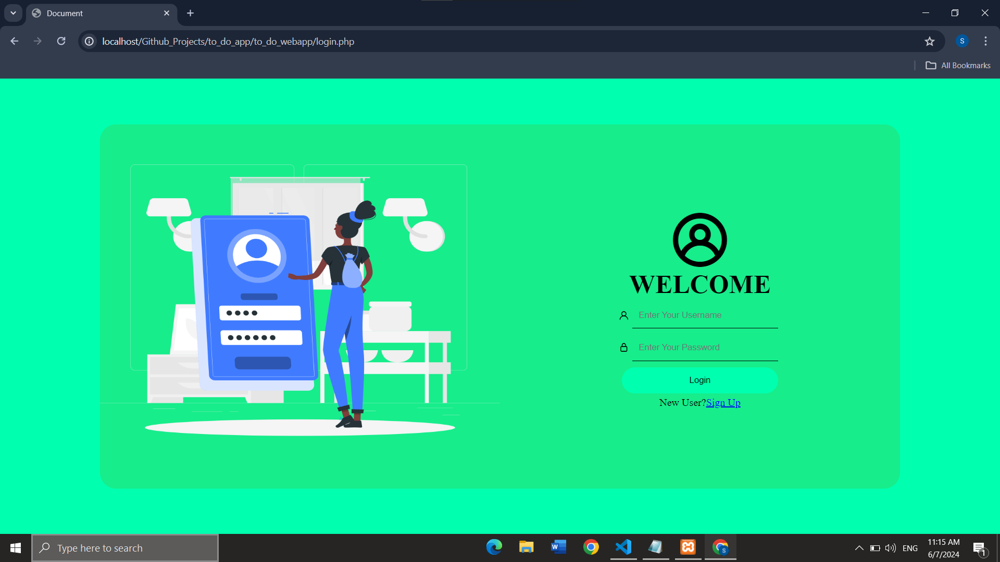
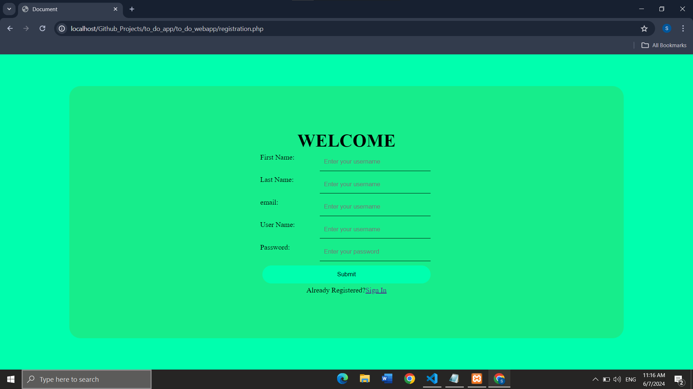
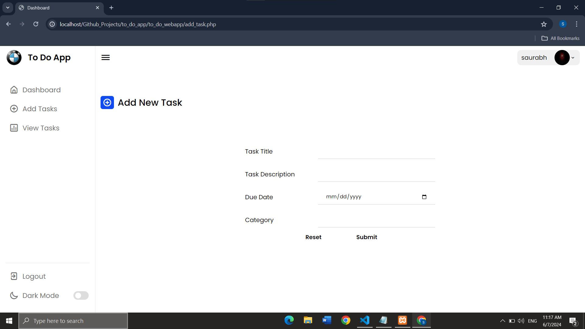
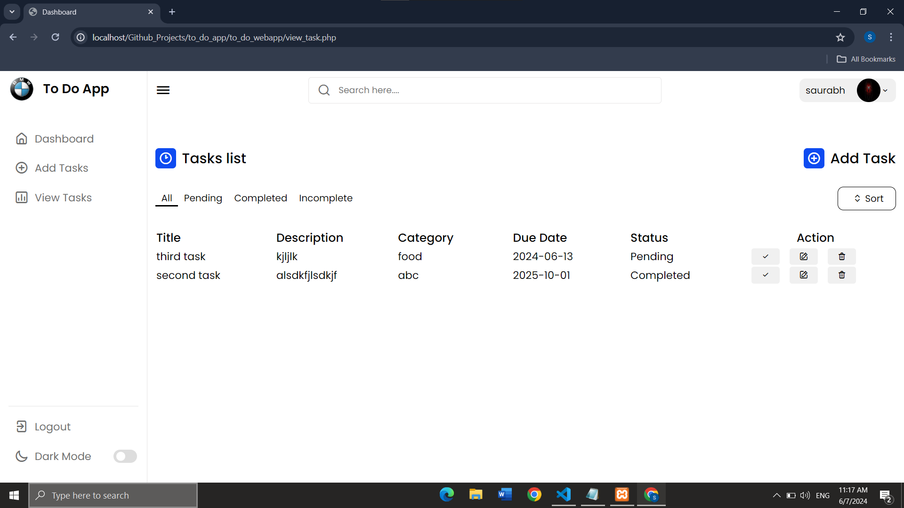
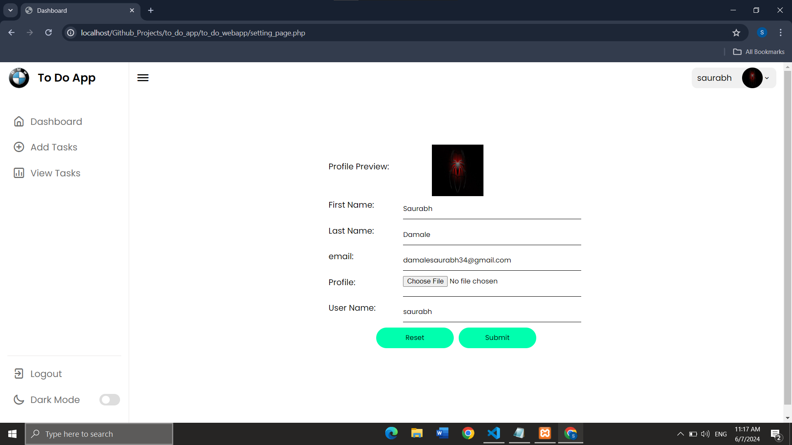

# To-Do App (PHP)

## Overview

The To-Do App (PHP) is a simple web-based application developed using PHP, MySQL, HTML, CSS, and JavaScript, jQuery and Ajax. It helps users manage their tasks and stay organized by providing features such as task creation, updating, deletion, deadline setting, and task prioritization. This app is suitable for personal use or team collaboration, providing an efficient way to track tasks and increase productivity.

## Features

- **Task Management:** Allows users to create, update, and delete tasks easily.
- **Deadline Setting:** Enables users to set deadlines for tasks to prioritize and manage time effectively.
- **Task Prioritization:** Provides options to prioritize tasks based on importance or urgency.
- **Task Categories:** Allows users to categorize tasks into different categories or projects for better organization.
- **Task Status:** Provides status indicators to track the progress of tasks, such as "Completed," "Incompleted," and "Pending."
- **User Authentication:** Supports user authentication to ensure data privacy and security.
- **Responsive Design:** Adapts to different screen sizes for seamless usage on various devices.

## Technologies Used

- **PHP:** Backend scripting language for server-side development.
- **MySQL:** Relational database management system (RDBMS) for data storage and management.
- **HTML/CSS:** Frontend languages for defining the structure and styling of the app interface.
- **JavaScript:** Frontend scripting language for implementing dynamic and interactive features.

## Usage

Follow these steps to set up and run the To-Do App (PHP) locally:

1. **Clone the Repository:**
   - Clone the repository to your local machine using the following command:
     ```
     https://github.com/HackRoot1/to_do_webapp.git
     ```

2. **Import Database Schema:**
   - Import the provided SQL database schema (`todoapp.sql`) into your MySQL database using a tool like phpMyAdmin.

3. **Set Up Database Connection:**
   - Navigate to the `config.php` file in the project directory and update the database connection settings (hostname, username, password, database name) according to your MySQL configuration.

4. **Start a Local Server:**
   - Start a local server (e.g., Apache) on your machine to run the PHP scripts. You can use tools like XAMPP or WAMP for easy setup.

5. **Access the App:**
   - Open a web browser and navigate to the local server URL to access the To-Do App (PHP).

## Project Structure

- **index.php:** The main entry point of the application.
- **config.php:** Configuration file for database connection and other settings.
- **/assets:** Directory for storing CSS stylesheets, JavaScript, images files.
- **/includes:** Directory for PHP include files containing reusable code and functions.
- **/uploads:** Directory for uploading and storing files or documents related to tasks.

## Demo Screenshots


*Login Page: User Login Page*


*Registration Page: User can register*


*User Dashboard: View and Manage upcomming Tasks*


*Add Tasks: Add new Tasks*


*View Tasks: View and manage all tasks*


*Profile Page: View and manage Profile Settings*


## Contributing

If you'd like to contribute to the project, feel free to fork the repository, make changes, and submit a pull request. Your feedback, suggestions, and contributions are highly appreciated and will help improve the app further.
